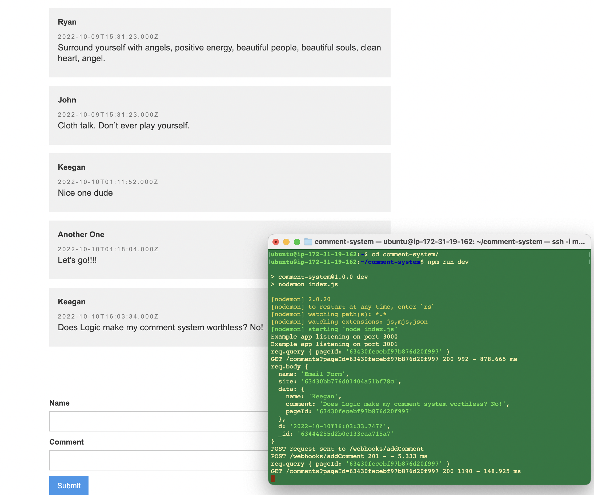
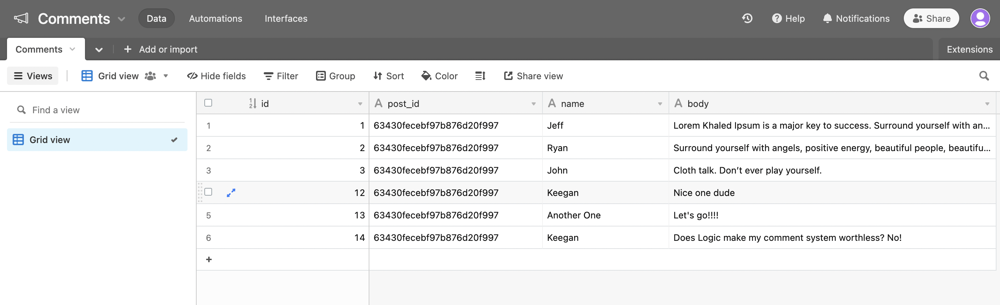
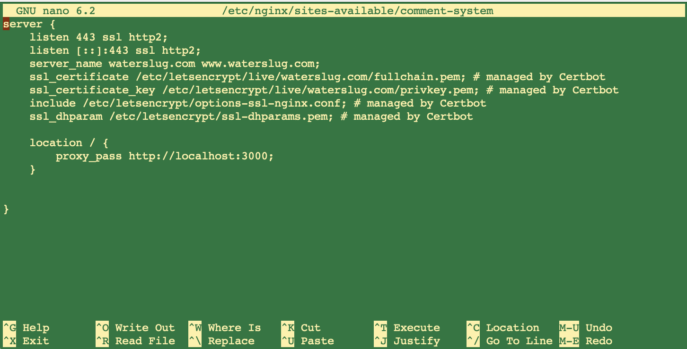

# Zapier-like microservice to add Comments to a Webflow blog

## Goal

My goal for yesterday's hackathon was to build a Zapier-like microservice to manage a comment system for a blog in Webflow. I was curious if this is a viable SaaS product.

## How it Works

It receives form submissions via webhooks and sends them to Airtable and also acts as an API to GET comments from Airtable so you don't have to expose your API key. Webflow doesn't give us access to store environment variables with our published websites 😢.

## Challenges

The microservice run on a t2.micro instance in AWS. One challenge was that since the requests are coming from https (https://subdomain.webflow.io domain) I also had to make my microservice communicate over https which I had never done before. Certbot will only generate certs for named domains, but luckily I have some unused Google Domains (waterslug.com) that were ripe for this project. NGINX also has to be configured to forward ports 80 and 443 to my service port (3000). Lastly (but may be more useful to put this firstly), to persist the setup I used AWS elastic IP to make sure the t2.micro instance wouldn't change between shutdown/startup cycles.

## Business Case

😅 The actual functionality of adding comments can now be done in less than 5 min with Webflow Logic. Zapier's free tier could also handle this relatively easily. My thought was maybe there's room for a drag and drop service that's easier to set up (although Logic is pretty easy in this circumstance) and only charge when users start getting lots of comments.

Users are further limited by Webflow and Airtable: 1200 record limit per base in Airtable, 50 form submissions per month (non-hosted site), 1000 form submissions per month (hosted site). These are pretty generous really. While I can set it all up for very low cost, the performance and ease of Logic is just better and my solution still cannot get around the pain points without requiring Webflow/Airtable account upgrades.

Yea so... Logic wins.

I'm canning this idea for now... I think there was a lot of learning had in building something for the sake of building it. I learned a lot about https protocol, webhooks, the Airtable and Webflow APIs, browser security, and Amazon Web Services
